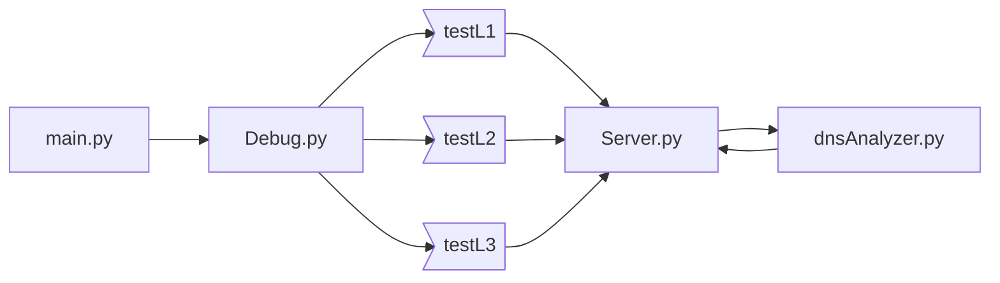

# DNS中继服务器

###### PB15081576 蔡文韬

## 代码运行

### 环境

linux，python3，解释器：cpython

### 操作

在/src文件夹下

```bash
sudo python3 main.py
```

启动DNS程序


可以使用脚本`dig.sh`

```bash
chmod +x dig.sh&&./dig.sh
```

用脚本dig一些网址，包含了ip cache中黑名单网址，其他网址和需要中继DNS的网址

`dig.sh`：

```bash
dig baidu.com @127.0.0.1
dig gin.ru  @127.0.0.1
dig hotbar.com @127.0.0.1
dig www.9p.com @127.0.0.1
dig test1 @127.0.0.1
dig test2 @127.0.0.1
dig sohu.com @127.0.0.1
dig jd.com @127.0.0.1
dig sina.com.cn @127.0.0.1
dig weibo.com @127.0.0.1
```


### 实现功能

- [x] 不良网站拦截功能：在本地ip cache中找到对应ip为'0.0.0.0'，返回域名不存在

  

- [x] 服务器功能&中继功能：

  具体实现可看`Server.py`中的`class UDPHandler(socketserver.BaseRequestHandler)`

  ```python
  
  class UDPHandler(socketserver.BaseRequestHandler):
      """
      https://docs.python.org/3.4/library/socketserver.html
      a udp handler for relay DNS
      """
      def handle(self):
          """
          :type local_cache: dict
          """
          
          data = self.request[0].strip()
          sock = self.request[1]
          analyzer = DNSAnalyzer(data) #对DNS报文进行分析
  
          if analyzer.query.type == 1:
              # 如果是request报文
              domain = analyzer.get_domain()
              if domain in local_cache:
                  # 在本地
                  ip = local_cache[domain]
                  analyzer.set_ip(ip)
                  if ip == "0.0.0.0":
                      # 此处打印相应信息
                  else:
                      # 此处根据debug级别打印相应信息
                  sock.sendto(analyzer.response(), self.client_address)
                  # 将reply报文发送给client
                  
              else:
                  # relay
                  public_request.append((sock, data.upper(), self.client_address))
                  # 将请求报文压入栈，等待threading处理
          else:
              sock.sendto(data.upper(), self.client_address)
  ```


  

  其中baidu.com, sohu.com是中继服务器返回的(我使用的是114.114.114.114)，ustc是ip cache中的

- [x] 调试级别1：上述就是debug level 1

- [x] 调试级别2：输入自选的public server和ip cache file（可以两个一起缺省，使用默认值，不能只缺省一个），输出时间坐标，序号，域名和ip

  

- [x] 调试级别3：输入自选的public server（可以缺省），输出接收和发送数据包的地址以及端口，以及数据报的内容

  

- [x] 多客户端并发&超时处理：

  * 实现方法：使用了`threading`模块，当handler接收到一个需要中继服务器的请求时，就把它压入`public_request`栈中，然后在`Class Server`的方法`UDPThreading`中pop出，发送到中继服务器，等待2s，如果没有回复，则timeout，如果有，则根据debug level输出需要的信息

    ```python
    def UDPThreading(self):
            # start a loop to deal with task queue
            cur = 0
            while True:
                if len(public_request) > 0:
                    if cur < MAXQUEUE: cur += 1
                    else: cur = 0
                    #队列
                    
                    sock, data, client_address = public_request[0]
                    analyzer = dnsAnalyzer(data)
                    id[cur] = analyzer.get_id()
                    #id是一个dict，给request分配一个cur，将id存入
                    
                    self.sock.sendto(analyzer.request(cur), self.public_server)
                    
                    try:
                        reply, addr = self.sock.recvfrom(BUFSIZE)
                    except socket.timeout:
                        print(":: DNS timeout for 2 sec.\n")
                        continue
                        #超时
                    else:
                        reply_analyzer = DNSAnalyzer(reply)
                        domain = reply_analyzer.get_domain()
                        ip = reply_analyzer.get_ip(reply)
                        #打印相应信息......
                        if testLev == 2:
                            socTime = time.ctime()
                            print("\n:: WHEN: {}".format(socTime))
                            print(":: ID: {}".format(id[cur]))
                        elif testLev == 3:
                            -#打印相应信息......
                        rest = reply[2:]
                        Id = id[cur]
                        #将id从dict中取出
                        reply = struct.pack("!H", Id) + rest
                        sock.sendto(reply, client_address)
                        
                    public_request.pop(0)
                    # FIFO
    ```

  * 运行dig.sh，相当与并发查询多个网站，处理结果良好。

    


## 代码结构



`main.py`：提供promt message，根据用户输入信息进行判断，进入test模块

`tests.py`：定义了三种测试等级(testL1()，testL2()，testL3())，

​			testL2后面的参数可以全部缺省，表示使用public server和本地缓存，但不可以只缺省一个

​			testL3的逻辑和testL2相同。提供ip valid check (ipv4)，用于二，三级测试的情景。

​			将选定的public serve，端口号和本地ip cache文件的地址提供给`Server`模块。

`LoadCache.py`：根据ip cache的地址建字典并返回该字典

`Server.py`：

* `Class Server`：
  * `__init__`: 初始化
  * `loadCache`：加载本地ip缓存文件
  * `run`：启动服务器程序
  * `UDPThreading`：多线程，支持并发
* `Class UDPHandler`：根据[https://docs.python.org/3.4/library/socketserver.html#socketserver-udpserver-example](https://docs.python.org/3.4/library/socketserver.html#socketserver-udpserver-example)上面的指导构建一个handler：
  * 在本地ip缓存中找到：
    - 找到且为'0.0.0.0'：报错
    - 找到且不为'0.0.0.0'：返回ip，根据调试等级返回其他信息
  * 没有在本地ip缓存中找到：将当前的请求打包好，加入队列中，等待处理

`DNSAnalyzer.py`：

* `Class DNSAnalyzer`：

  * `__init__`：用`struct.unpack`处理header（前12bytes）

    ```python
    ef __init__(self, data):
            (self.Id, self.Flags, self.QdCount, self.AnCount, self.NsCount, self.ArCount) = \
                struct.unpack('!HHHHHH', data[0: 12])
    ```

    | DNS HEADER |
    | :--------: |
    |     ID     |
    |   FLAGS    |
    |  QDCOUNT   |
    |  ANCOUNT   |
    |  NSCOUNT   |
    |  ARCOUNT   |

    并调用`DNSQuestion`分析请求部分

  * `set_id`

  * `get_id`

  * `get_domain`

  * `set_ip`

* `Class DNSQuestion`：

  * `__init__`：unpack question部分

    ```python
    class DNSQuestion:
        def __init__(self, data):
            i = 1
            self.domain = ''
            self.ip = ''
            while True:
                d = data[i]
                if d == 0:
                    break
                elif d < 32:
                    self.domain += '.'
                else:
                    self.domain += chr(d)
                i += 1
            self.package = data[0: i + 1]
            (self.qtype, self.qclass) = struct.unpack('!HH', data[i + 1: i + 5])
            self.len = i + 5
    ```

    | DNS Question |
    | :----------: |
    |    QNAME     |
    |    QTYPE     |
    |    QCLASS    |

  * `get_bytes`：返回封装好的question部分

* `Class DNSRRF`：

  * `__init__`：初始化Rescource Record Format

    ```python
    class DNSRRF:
        def __init__(self, ip):
            self.name = 49164
            self.qtype = 1
            self.qclass = 1
            self.ttl = 200
            self.datalength = 4
            self.ip = ip
    ```

    | Resource Record Format |
    | :--------------------: |
    |          NAME          |
    |          TYPE          |
    |         CLASS          |
    |          TTL           |
    |        EDLENGTH        |
    |         RDATA          |

    rdata从第13个bytes开始。

  * `get_bytes`：返回封装好的rrf


## 实验中遇到的问题

1. `dig baidu.com @127.0.0.1`的时候遇到id mismatch 报错

   ```bash
   dig baidu.com @127.0.0.1
   ;; Warning: ID mismatch: expected ID 26454, got 18262
   ;; Warning: ID mismatch: expected ID 26454, got 18262
   ;; Warning: ID mismatch: expected ID 26454, got 18262
   ```

   dns程序返回：

   ```bash
   ----------------------------------------------------
   
   :: ANSWER SECTION:
   
      BAIDU.COM.   123.125.115.110
   
   
   ----------------------------------------------------
   
   ```
